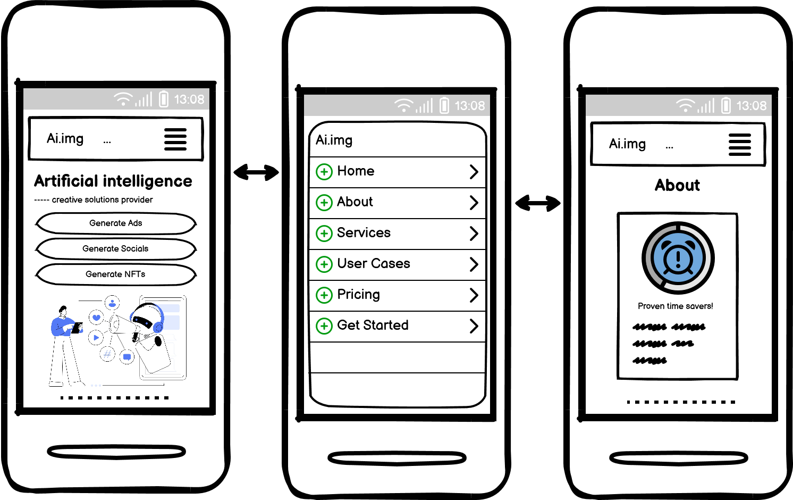
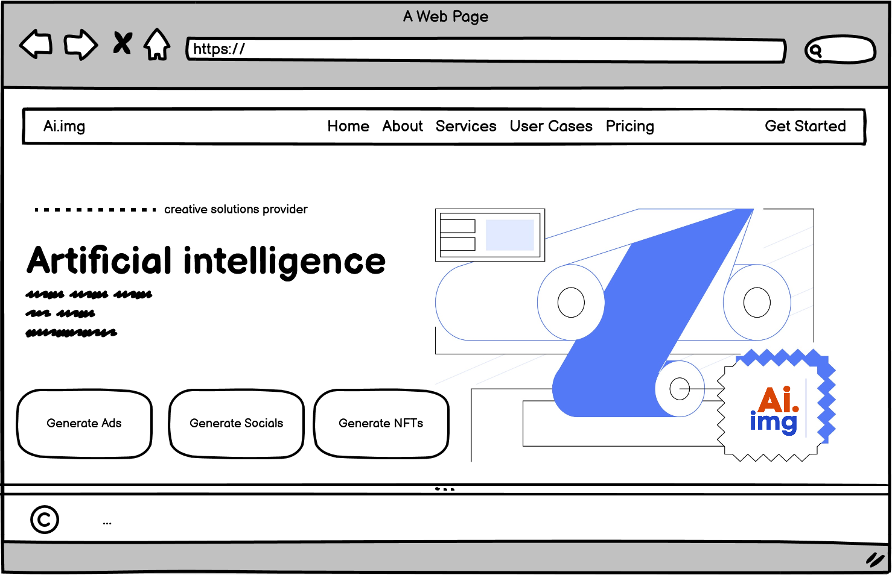
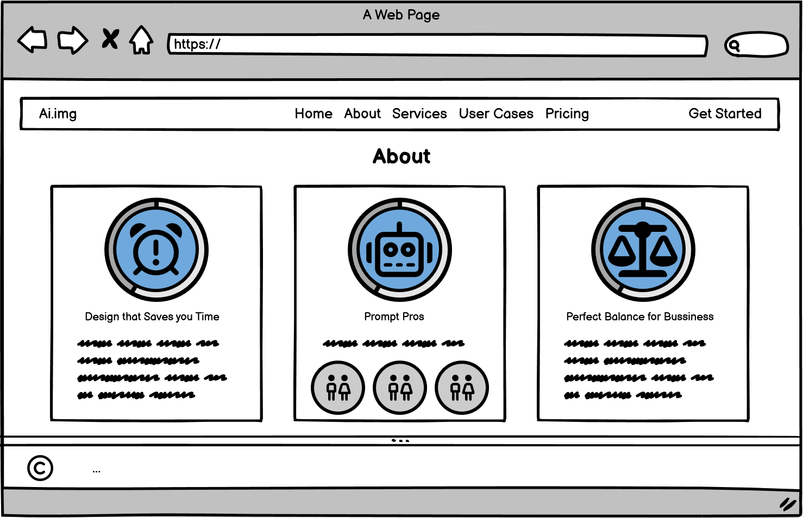
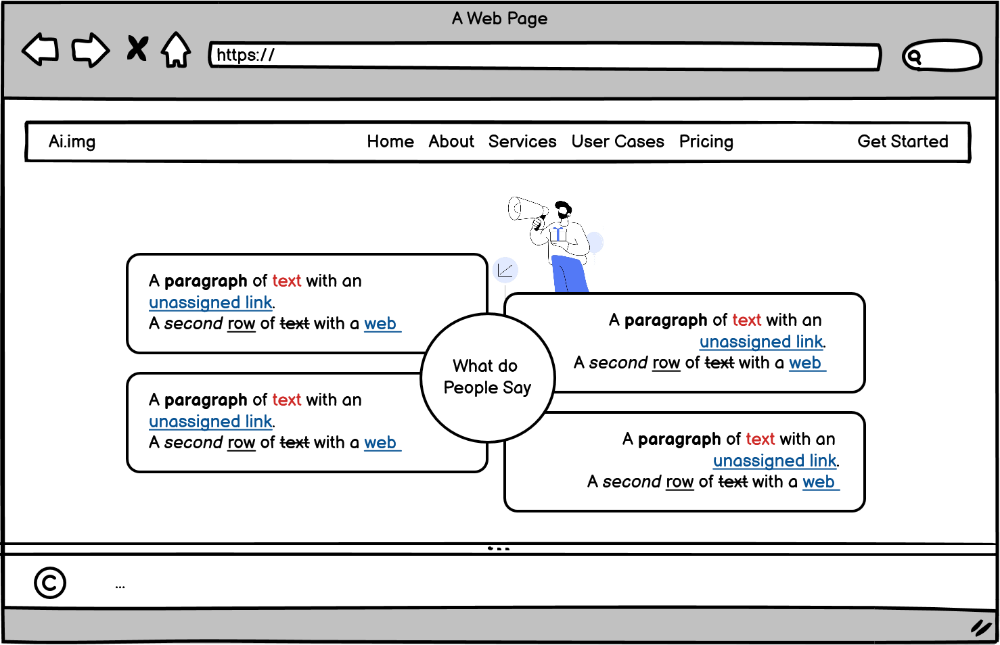
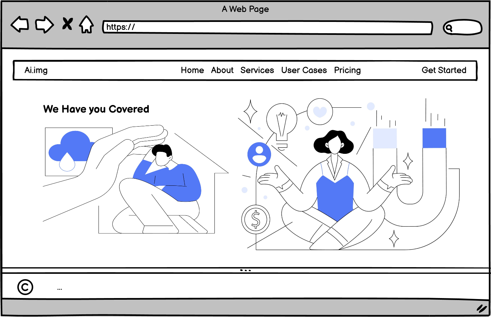
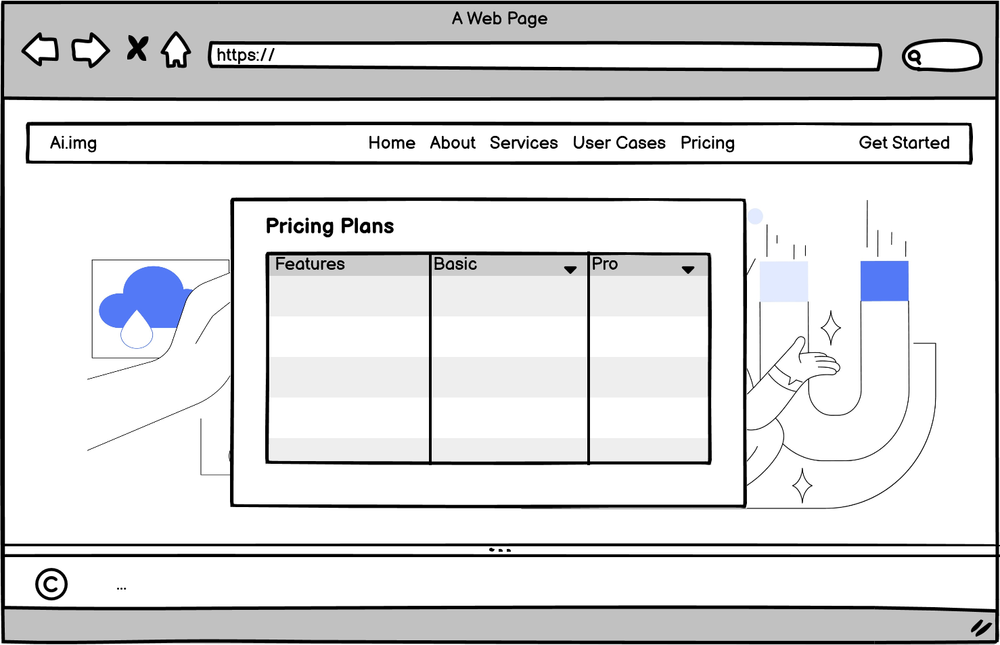
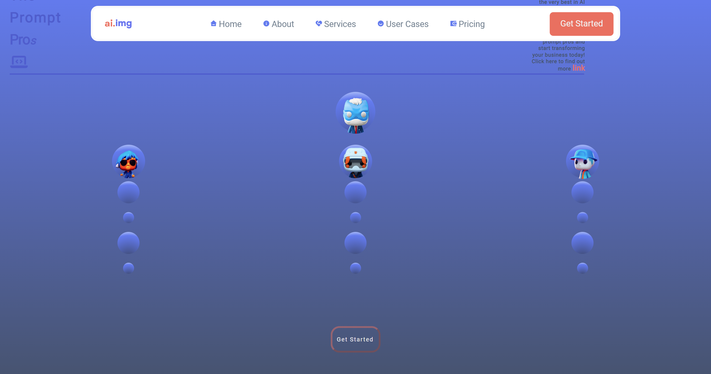
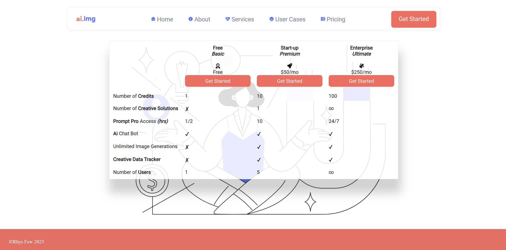

# Ai.img

# Code Institute Portfolio Project 1: Front end project using HTML and CSS deployed via Github.
### To view the project please [click here](https://ry-f3.github.io/ai.img-v2/).
 

## **Background**

Disclaimer: This website template contains a collection of practical ideas that are hypothetical and related to the rise of Artificial Intelligence (AI). The images used in this template have been licensed via Adobe and some have been created using WOMBO dream, which is an Artificial Intelligence image prompt service. While there may be some grey areas surrounding their use, I hope that legislation will eventually catch up and clarify what is legal. Throughout the website, you may come across some terms and abbreviations, such as "text to image" (t>i) and "prompt pros," which are original thoughts. However, it's likely that others in the information industry have also coined similar phrases.
Here are the simplified points that convey the thesis of the proposed business model:

**How can AI drive the creative commercial industry forward?** 
By leveraging data and analytics, AI can guide businesses in making accurate decisions to stand out in a crowded market. AI can identify consumer preferences, such as colour choices, and curate creative content with pinpoint accuracy in a fraction of the time.

**What is text-to-image technology?** 
Text-to-image AI programs allow users to input keywords and generate images at will. However, these programs can present issues in terms of usability and scalability for advertisers and social media platforms. Therein lies an identifiable issue that can be tackled with a solution.

**Why would businesses choose an AI creative solutions provider?** 
To address usability and scalability issues, businesses need text-to-image specialists, or "Prompt Pros," with a machine learning background who can optimise text-to-image programs. Prompt Pros could create content for various business types, including advertisers, social media influencers, and NFTs.

**How would the business model function?** 
The business model would be promoted as a subscription-based service, with different levels of access. Initially, there would be a basic free service to showcase capabilities and act as free advertising. To unlock further usability, clients would need to pay a monthly fee. The team of Prompt Pros would be divided into teams with assigned case loads and would serve as a gateway to accessing the full potential of text-to-image technology, along with embedded data and analytics to provide clients with insights and metrics.

The purpose of outlining these points is to demonstrate the process of identifying an issue that can be resolved through effective marketing and a skilled team. The team is critical because the success of the service relies on their ability to leverage AI creative technology to address usability and scalability challenges.

## **Scope**
The website is a crucial tool for effective communication between businesses and their clients. In order to achieve this goal, it is essential to create a visual language that embodies professionalism while also incorporating a creative flair. This fusion of business and creativity must be carefully crafted to ensure that clients have confidence in the ability of the service provider to deliver high-quality results.
To achieve this unity, several key decisions were made during the design process. One such decision was to prioritise a smooth and free-flowing user experience (UX/UI) that allows users to navigate the website with ease. This led to the creative choice of having most of the content on a single page. However, this decision posed a challenge due to the mobile-first design approach and the limitations of a purely front-end design that relied on HTML and CSS. The problem-solving strategies employed to overcome these challenges will be discussed in detail in the appropriate section.

As an emerging branch in the tech industry, delving into AI creative technology has posed some challenges in terms of staying informed and up-to-date. However, I was fortunate to come across Adcreative.ai, which proved to be an incredibly helpful resource for generating content and refining wording. While AI certainly has its advantages in terms of speed and efficiency, it can sometimes lack the personal touch that businesses value when it comes to establishing trust and reliability. As such, I believe that a well-balanced approach that incorporates both AI technology and human input is key to achieving the best possible results for our potential clients.

Another crucial decision that was made was the careful consideration and evaluation of colour schemes. As someone with an art background, I understand that colour theory plays a significant role in eliciting specific responses and influencing human behaviour in certain circumstances. Therefore, it was important to select a colour scheme that conveys the desired message and creates a recognizable branding that is both creative and professional. The aim was to convey that the service provider is capable of skillfully doing the heavy lifting, leaving clients to focus on their core business operations.

Finally, the selection of illustrative imagery was also critical in creating a unified and cohesive website design. The intention was to align the imagery with the chosen colour scheme. However, the research process flipped this approach on its head, with the predominant colours informing the creative process. The result was a carefully curated selection of imagery that complemented the colour scheme and helped to convey the desired message to the target audience.

Overall, the design decisions made during the development of this website aimed to create a seamless and visually compelling experience that would build confidence in the service provider while also building loyalty with users.

## **Audience**

Our key demographic is business to customer (B2C) organisations, who may lack the technical expertise to implement new technology solutions on their own. These businesses are often interested in finding creative and innovative solutions to meet their high-paced needs in a fast-changing market. They understand the importance of staying ahead of the competition and are willing to invest in the right tools and services to achieve their goals.

Our ideal customers are decision-makers who value reliability and trust in their business partnerships. They are looking for a team that not only understands their business needs but also has the technical expertise to provide effective solutions. Our service could provide them with a competitive edge by delivering high-quality creative services that resonate with their target audience and help them achieve their business objectives.

We also cater to businesses that are open to exploring new technologies and are interested in experimenting with AI-driven creative solutions. These businesses are typically early adopters who understand the importance of staying ahead of the curve and are willing to take calculated risks to achieve their business goals.

On the whole, our target audience is businesses that prioritise innovation, creativity, and reliability in their business partnerships. We aim to provide them with a seamless experience and customised solutions that align with their specific business needs and goals.

## **User Stories**

When designing my website, it was important to keep in mind that users should be able to navigate it with ease. One way to achieve this is by conforming to conventions. Conventions refer to the common practices and standards that have been established in web design, based on years of research and user testing.

By following these conventions, it ensures that users can quickly and easily find the information they are looking for, without having to spend time figuring out how to use your website. For example, users expect to find a navigation menu at the top of the page, with links to the main sections of your site. They also expect to find a search bar in a prominent location, typically at the top right-hand corner of the page.

Another example of a convention is the use of familiar icons to represent certain functions, such as an 'i' for information or a shopping cart for e-commerce sites. By using these icons consistently, users can quickly understand how to interact with a website.

Conforming to conventions not only makes websites more user-friendly, but it also helps to establish credibility and trust with users. When users feel comfortable using a website, they are more likely to return and recommend it to others.

## **Wireframes**

I have been contemplating various project ideas during my foundation HTML and CSS learning, with the aim of creating something that is relevant to current technology. I began creating wireframes on March 2nd, 2023, and subsequently received feedback from my mentor, Antonio Rodriguez, with whom I discussed my ideas.

### **Mobile First Design**

Landing Page & About Section (Mobile): 

Service Page & User Cases (Mobile): 

User Cases Gallery & Pricing (Mobile): 

Get Started Form (Mobile): 

### **Desktop Scaling**

**Homepage (Desktop):** 

**About Page (Desktop):** 

**Services Page (Desktop):** 

**User Case Testimonials (Desktop):** 

**User Case Gallery (Desktop):** 

**Pricing Page Parallax Effect (Desktop):** 

**Pricing Page (Desktop):** 

**Get Started Form (Desktop):** 

## **Function**

The purpose of the index.html page is to serve as a two-page application. The landing page provides links for navigation or the user can use the conventional side scroll bar to view the website, where it features sections named: about, services, user cases and pricing. The get started button navigates to the form.html.

Unfortunately, the form.html is not fully functional, as I do not possess the necessary skills to create a working form, but I plan to conduct research to learn how to do so in the future. As a temporary solution for the project, users will be redirected to https://formdump.codeinstitute.net to submit their inquiries. 

**Screenshots of the final pages below:**

## **Features**

### **Header** 

The index.html page utilises a navbar in the header position for both pages. Through the use of sticky positioning, the navbar remains fixed at the top of the page as the user scrolls, enabling easy navigation throughout the application.

### **Footer**

I have kept the footer simple, featuring only my name and the copyright symbol. The colour scheme of the footer matches the rest of the application. In the future, I may consider expanding the footer by including links to my social media profiles and possibly adding a second navbar for important information, such as FAQs.

### **Unified colour scheme**

Regarding the colour scheme used in the project, I based it on the visual images licensed from [Adobe Stock](https://stock.adobe.com/uk/). Although this was a personal creative decision that helped shape the project's development, it is generally advised to start with a clean slate and allow the selected colours to inform the website's image choices. However, for this project, the colours used were intended to establish a warm and soothing ambiance while still remaining welcoming, which corresponds to the company's character. [Coolors.co](https://coolors.co/42526e-e97060-5c7af2-cdddfd-e7e5df) was used to showcase the unified colour scheme, I utilised various variations to produce light highlights and dark shades for depth.

### **Introductory text**

The purpose of the text is to provide information and quickly convey the purpose of the site to the user. By using different "heading" tags, I have been able to prioritise the user's attention. The buttons on the main hero image link to the products that would be offered. If the website were fully developed, they would direct the user to examples of work created by the company. For the purpose of this project, however, I have linked the user to appropriate articles related to AI and the products. In order to achieve a clickable link from a button using the html tag I used a small string of JavaScript <code>onclick="location.href='URL'"</code>. Initially I tried to use an "a" tag but when I validated my html I discovered that it was semantically incorrect. 

### **User feedback**

In order to gauge the effectiveness of my website and identify areas for improvement, I reached out to several Code Institute alumni, friends, and family members. Their feedback has been invaluable in shaping our approach moving forward.

To ensure the website's functionality on a variety of devices, I personally tested it on my *Razer laptop, Samsung Flip 3, and iPad*. Overall, the user experience was positive. However, I did observe some inconsistencies in browser support on Apple products. Specifically, icons appeared smaller and the navigation bar was not always able to drop down properly on smaller devices. I am actively working to address these issues and ensure that all users have a seamless experience on the website, regardless of their device or browser.

* **Iuliia Konovalova (Code Institute Alumni).** *unknown*
    * Semantic “h” tag  headings need to be in chronological order.
    * It is hard to distinguish the colours of the navbar upon drop down.
    * ~~Pricing table isn't responsive below a certain width (think about font sizes)~~.
         * *Updated and added to the website.*
    * ~~Metadata has not been inputted correctly~~.
        * *Updated and added to the website.*
    * ~~Put main content in the main element tag, excluding navbar and footer~~.
        * *I attempted to place my sections within the main tag, but unfortunately, this caused one of my buttons and links to stop functioning correctly. As a result, I have reverted to my previous HTML formatting.*
    * ~~Add an <code>aria-label=""</code> to each "a" element~~.
        * *Updated and added to the website.*

 

* **Adam Boley (Code Institute Alumni).** *Samsung A20*
    * Dropdown menu bars are not clickable only the text, which could be jarring for users.
    * ~~Navbar links opening a new tab, change to "a" tags for a nicer user experience~~.
         * *Updated and added to the website.*

 

* **Tom Harrington-Neal** *Samsung Note 20*
    * No major bugs found AND commented that overall it was a smooth experience.

 

* **Alex Majeed** *Google Pixel 6*
    * No major bugs.
    * Suggested to make the pricing table's text more visually distinct.

  

* **Nick Few** *Iphone SE*
    * No major bugs.
    * ~~Navbar links opening a new tab, change to "a" tags for a nicer user experience~~.
         * *Updated and added to the website.*

 

### **Internal Navigation**

Although the navbar is fully functional and responsive to various screen sizes, I encountered an issue when it came to the dropdown toggle. Since the content is primarily contained in one HTML file and there is no JavaScript involved, I struggled to find a solution, where the toggle would collapse naturally when a link would be clicked, without the need for the user to open it in a new tab, which is achieved using <code>target="_blank"</code>.

Whilst researching I came across a youTube video explaining " :has() Psuedo class selectors " [Click Link](https://www.youtube.com/watch?v=OGJvhpoE8b4&t=625s) it was incredible useful for helping me enable my navbar dropdown menu to expand and collapse, once the invisible checkbox was checked by the user. Insprired by Kevnin Powell's coding knowledge I wrote:  <code>nav:has(#input-6:checked) .nav-list {display: block;}</code>

For the practicality of viewing on i.e an Ipad, using media queries enabled the text to be hidden. 

On the other hand, viewing the navbar on a desktop provides a different and more engaging experience for the user. They can simply hover over the icons and see them enlarge, while the text fades and disappears. I am particularly proud of this piece of code, as I believe it creates a visually pleasing effect that adds to the overall aesthetic of the website. This was achieved by researching and analysing CSS Tricks's page [Click Link](https://css-tricks.com/snippets/css/scale-on-hover-with-webkit-transition/).

### **Image Galleries** 

Initially, the plan was to create a gallery page to showcase hypothetical examples of the business's work. However, due to the purely front-end nature of the project, I was unable to include a carousel for interactive browsing of the gallery while adhering to semantic conventions. However, all of the images used in the project apart from the team page have been licensed.

### Contact form

Our contact form has been thoughtfully designed to invite users to become members and take advantage of the comprehensive services offered by our hypothetical business models. We offer three membership levels - basic, start-up, and enterprise - and users can choose the medium they wish to inquire about. Upon submitting their inquiry, our prompt and professional team of experts will provide tailored advice and exceptional services to ensure that all our members' needs are met.

### **Accessibility**

Device responsivitiy tested on [Am I Responsive](http://ami.responsivedesign.is/#) and [Responsintator](http://www.responsinator.com/).

## **Design Choices**

### **Font**

Font pairing is an important aspect of web design, as it can greatly affect the readability and overall aesthetic of a website. In this case, Font Awesome has chosen to pair PT Sans and Roboto to create a harmonious and visually pleasing experience for users.

PT Sans is a sans-serif font that was designed by Alexandra Korolkova, Olga Umpeleva, and Vladimir Yefimov in 2009. It has a modern and elegant appearance, with rounded edges and open apertures, making it easy to read both on screen and in print. It is often used for headings, subheadings, and body text.

On the other hand, Roboto is a sans-serif font developed by Christian Robertson in 2011. It has a more geometric and futuristic look, with sharp edges and clean lines. It was designed specifically for use on digital interfaces, and its excellent legibility makes it a popular choice for body text on websites.

By pairing PT Sans and Roboto, Font Awesome has created a complementary blend of modern and classic styles. This is particularly suitable for a website offering AI services that seeks to push the boundaries of creativity. The combination of PT Sans' roundness and Roboto's sharpness results in a balanced and visually appealing design that is easy to read and navigate.

### **Layout and Structure**

The layout and structure of my website were heavily influenced by [adcreative.ai](https://www.adcreative.ai/). I used this website as a reference and tried to emulate certain aspects while adding my own unique touch. To plan my website's layout, I used [Balsamiq](https://balsamiq.com/) to create a basic visual structure to work from. However, as the creative process unfolded, I deviated quite significantly from the initial plan.

The home page, in particular, underwent numerous changes as I explored different design options and experimented with various elements. I made adjustments to the placement of certain components, altered the colour scheme, and revised the content in response to feedback from peers.

While adcreative.ai provided the inspiration for my website's structure, I am proud of the ways in which I personalised and customised it to suit my specific needs and goals. The creative process was iterative and dynamic, and I believe that the end result is a website that reflects my own unique style and approach.

Examples of changes to the home page:

Stage 1            |      Stage 2  |           Stage 3 |             Stage 4
:-------------------------:|:-------------------------: |:-------------------------: |:-------------------------:
  |   |   |   

### **Colour schemes**

These colors work well together for a creative business website for several reasons:

1. Blue is often associated with professionalism, trustworthiness, and creativity, making it a good choice for a creative business website. The bright blue shade **(#5C7AF2)** is eye-catching and attention-grabbing, which can help to draw visitors to the website.

2. The warm red-orange shade **(#E97060)** adds energy and passion to the color scheme, which can help to convey the creative and innovative nature of the business. This color can also evoke feelings of excitement and enthusiasm, which can help to engage visitors and keep them interested in the website.

3. The light blue-gray shade **(#CDDDFD)** adds a sense of calm and tranquility to the color scheme. This color can help to balance out the brighter, more energetic colors and create a sense of harmony and balance on the website.

4. The muted blue-gray shade **(#42526E)** adds depth and sophistication to the color scheme. This color can help to create a sense of elegance and professionalism on the website, which can be important for a creative business that wants to convey a sense of quality and attention to detail.

Overall, these colors work well together for a creative business website because they create a dynamic and engaging color scheme that can help to convey the energy, creativity, and professionalism of the business.

## **Bugs**

During the development of my website, I utilised tools such as the [W3 HTML](https://validator.w3.org/) and [Jigsaw](https://jigsaw.w3.org/css-validator/) CSS validators to identify and resolve inconsistencies in my code. These validators helped me to ensure that my code was clean and compliant with web standards, which is essential for creating a website that is accessible and user-friendly.

In addition to using these tools, I also sought feedback from my peers and other users to identify any issues or areas for improvement. This feedback was invaluable in helping me to refine and improve my website, as it provided me with a fresh perspective and helped me to see things from the user's point of view.

Through this process of validation and feedback, I was able to identify and fix some issues with my code, including incorrect syntax, missing or broken tags, and inconsistencies in styling. This allowed me to create a website that is well-structured, easy to navigate, and visually appealing.

In conclusion, by using tools such as validators and seeking feedback from others, I was able to ensure that my website is of high quality and meets the needs of its users.

**List of known bugs:**

* Jigsaw recognises the :has pseudo selector as a *parse error* - note this was used for the navigation dropdown menu, there is  currently only some browser support.

* Responsivity of the pricing table breaks the formatting of the website below a width of 313px.

* Heading "Why Ai.img?" becomes hidden on some devices when viewed in landscape mode.

 

**List of fixed bugs**

* There were several problems with the responsiveness of the landing page, which led to significant changes in the visual design to ensure a more consistent user experience. One of the issues was that buttons overlaid on specific areas of an image would move depending on the width of the screen, resulting in an inconsistent layout and structure. To address this issue, an excessive number of media queries would have been necessary. As a result, I had to make significant adjustments to the visual design to ensure a clear and effective representation of the intended layout and structure on various screen sizes.

* W3 Html validator highlighted stray element tags that were not closed properly.

* The text positioning featured on the user cases (team page), needed adjusting several times for responsivity.

* Button elements cannot have an "a" tag as a direct child or be the parent.

## **Future work**

In the future, I would like to explore how to create a complete and functional form that can securely store and manage user data and information. This form should be designed with user experience and data privacy in mind, ensuring that users can easily input and submit their information while also protecting their data from any unauthorized access or misuse.

Additionally, I would like to investigate the feasibility of using third-party solutions for generating artificial intelligence (AI) images. This would involve testing various AI image generation tools and platforms to determine their accuracy, speed, and overall performance. This research would also consider the potential ethical implications of using AI-generated images and the importance of ensuring that such images are used responsibly and transparently.
 
## **Technologies**

* [Github](https://github.com/) 
    * Hosted the project's repository. 

* [Gitpod](https://gitpod.io/) 
    * Utilised an IDE with version control capabilities to edit and create files.

* [Github Pages](https://pages.github.com/) 
    * Used to deploy the website.

* [Balsamiq](https://balsamiq.com/) 
    * Utilised a tool for creating wireframes to plan the project.

* [Slack](https://slack.com/intl/en-gb/) 
    * Used a platform to connect with my mentor and fellow course alumni.

* [Remixicon](https://remixicon.com/)
    * Used for most of the website's icons.

* [Font Awesome](https://khan.github.io/Font-Awesome/) 
    * Used for some of the website's icons.

* [Google Fonts](https://fonts.google.com/)
    * Used tool to pair fonts.

* [Responsinator](http://www.responsinator.com/)
    * Used to test the responsiveness of the website. 

## **Testing**

### **Testing User Stories**

| User Story   | Fulfilment | 
| ------------------------------------------------------------------ |:---------------------------------------------|
User should be able to easily identify purpose of the website | The introductory text clearly states that the bussiness is an AI creative solutions provider and lists the specialist products
User should be able to easily navigate the page | Navigation bar is fully responsvie or the user can simply scroll the different page sections
User should be able to easily reach the membership form | Links and buttons are used to direct the user to these locations, but it could do with more *emphasis* and direction to be clicked
User should be able to have product choice | This form allows the user to select multiple products by clicking on them, if desired

### **Testing functionality**

| Input     | Result   | Intention   |
| ------------------------------------------------------------------ |:---------------------------------------------| :---------------------------------------------------------|
Click on navbar links/icons | Takes the user to the approriate page | Take the user to the approriate page
Click on home page product buttons | Takes the user to URL destination | Take the user to URL destination (note a fully realised project would link to examles of work via a gallery)
Click on navbar "get started" button | Takes the user to form.html | Take the user to form.html
Click on link team page/user cases | Take the user to the membership pricing plans | Takes the user to the membership pricing plans
Click on get started button on team page/user cases | Takes the user to form.html | Take the user to form.html
Click on hamburger icon | Dropdown menu appears for user navigation | Dropdown menu appears for user navigation
Click on "get started" button pricing page | Take the user to the membership pricing plans | Takes the user to the membership pricing plans
Scroll | User navigation of the website without using the navigation links | User navigation of the website without using the navigation links

### **Testing on different devices**

To ensure that my project was accessible to the widest possible range of users, I sought feedback from individuals who used a diverse range of devices. This included users who accessed the project on desktop computers, laptops, tablets, and smartphones.

* *Razer Book 13*
* *Razer Blade 15*
* *Ipad Pro 11*
* *Samsung Tablet*
* *Google Pixel 6*
* *Samsung Note 20*
* *Samsung A20*
* *Samsung Flip 3*
* *Iphone SE*

### **Testing code**

#### **HTML validation**

Upon performing HTML validation on 31/03/23, there were no errors found in the code of the web page. This means that the HTML code of the page was properly structured and formatted according to the standards set by the W3C. This is a positive outcome, as it indicates that the web page is likely to perform well across different browsers and devices, and that it should be accessible and user-friendly for a wide range of users.

**Index.html** - No issues or errors found.

**Form.html** - No issues or errors found.

#### **CSS (Jigsaw) validation**

**Stylesheet.css** - Two erros found. I am certain that the errors are occuring because the :has pseudo selector has limited browser support. Though a parse error does refer to all instances of the <code>;} (semicolon curly bracket) or just a } (curly bracket)</code> being used incorectly within the code. If any reader knows the reasoning I would appreciate the feedback.

#### **Lighthouse performance testing**

##### Desktop:

**Index.html**:
- Performance: 99
- Accessibility: 96
- Best Practices: 92
- SEO: 100

**Form.html**:
- Performance: 99
- Accessibility: 86
- Best Practices: 100
- SEO: 100

##### Mobile:

**Index.html**:
- Performance: 88
- Accessibility: 96
- Best Practices: 92
- SEO: 100

**Form.html**:
- Performance: 78
- Accessibility: 86
- Best Practices: 100
- SEO: 100

## **Credits**

Developed by **Rhys.Alexander.Few**

### **Code**

I would like to express my gratitude to the content creators who have helped me expand my coding knowledge. Their tutorials, videos, and blogs have been instrumental in helping me to build my technical skills and achieve my coding goals. Their contributions have made a significant impact on my personal and professional growth, and I am truly grateful for their dedication.

* **Kevin Powell** 
    * Chevron page shape - [YouTube Video](https://www.youtube.com/watch?v=QY7Rj8aZcZk&t=757s).
    * :before and :after Pseudo Selector - [YouTube Video](https://www.youtube.com/watch?v=xoRbkm8XgfQ&t=419s).
    * :has Pseudo selector - [YouTube Video](https://www.youtube.com/watch?v=OGJvhpoE8b4).

 

* **Chris Coyier** 
    * Transition in and out -  [CSS Tricks](https://css-tricks.com/snippets/css/scale-on-hover-with-webkit-transition/).

 

* **Unknown** 
    * Spheres - [CSS Animation](https://cssanimation.rocks/spheres/).

 

* **Ana Tudor** 
    * Speech Bubble (cut content in demo files within the bin folder) - [CSS Animation](https://cssanimation.rocks/spheres/).

 

* **Web Cifar**
    * This code was essential to the development of my roadmap - [Codepen](https://codepen.io/Web_Cifar/pen/jObBvqN).

 

* **Adam Boley** 
    * Markdown Language and Readme guidance and peer review.

 

* **Iuliia Konovalova** 
    * Coding HTML and CSS sugestions and peer review.

 

* **Antonio Rodriguez** 
    * Project guidance and showing me how I would use JavaScript for the hamburger toggle in the future.

### **Images**

Main content images used adobe stock and the character creation for the team page were generated using an ai programme called dream.

* **Visual Generation**
    * [Adobe Stock](https://stock.adobe.com/uk/contributor/201052191/visual-generation?load_type=author&prev_url=detail).

* **dream by WOMBO**
    * [dream](https://dream.ai/)

### **Acknowledgements**

I would like to express my heartfelt gratitude to the alumni of the course for their generous efforts in reviewing my code and providing me with invaluable feedback on how I could make current and future changes to my work. Their knowledge and expertise have been of immense help to me and will undoubtedly aid me in my coding journey going forward.

In addition, I would also like to extend my appreciation to my friends and family who have been unwavering in their support. They have spent countless hours listening to my ideas and providing constructive feedback, which has helped me to refine my work and improve my skills. Their encouragement and guidance have been instrumental in my success, and I am grateful to have such a wonderful support system.

