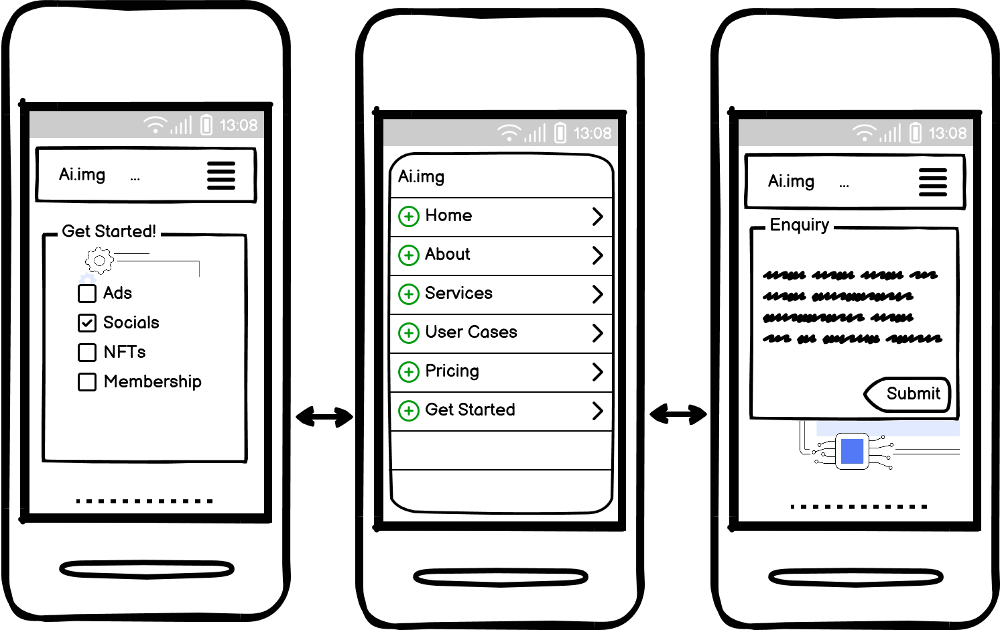
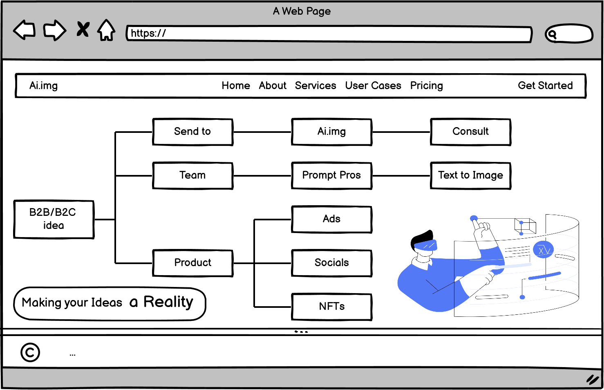
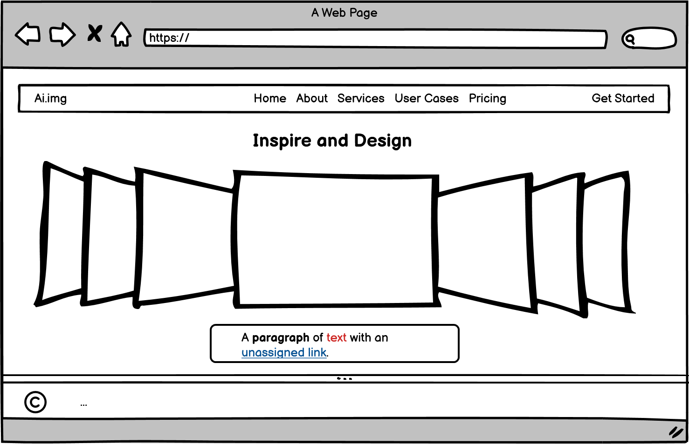
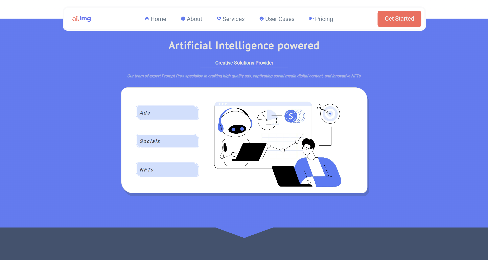
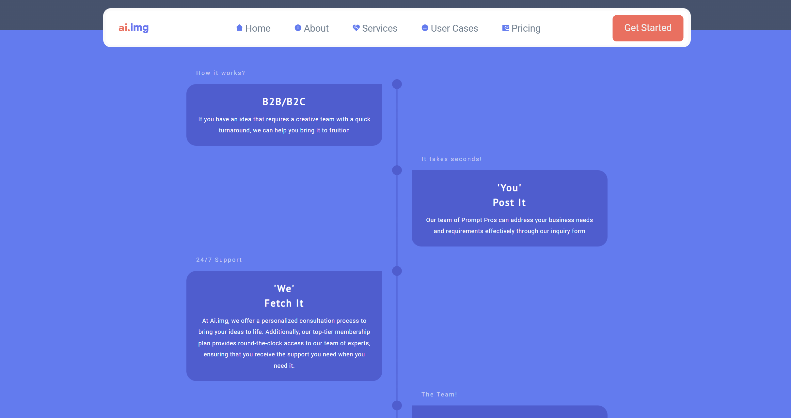
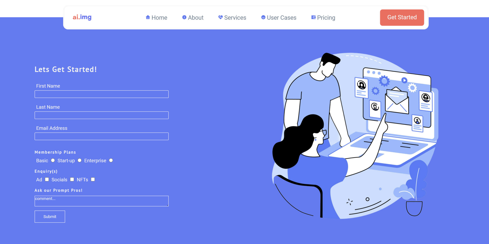
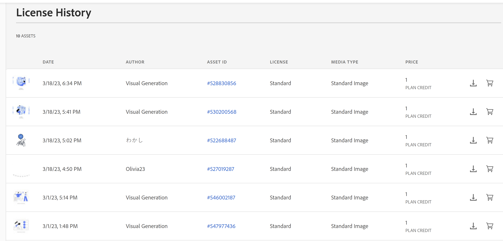

# Ai.img

# Code Institute Portfolio Project 1: Front end project using HTML and CSS deployed via Github.
### To view the project please [click here](https://ry-f3.github.io/ai.img-v2/).
 

# Table of Contents

- [Background](#background)
- [Scope](#scope)
- [Audience](#audience) 
- [User Stories](#user-stories)
- [Wireframes](#wireframes)
    - [Mobile First Design](#mobile-first-design)
    - [Desktop Scaling](#desktop-scaling)
- [Function](#function)
- [Features](#features)
    - [Header](#header)
    - [Footer](#footer)
    - [Unified Colour Scheme](#unified-colour-scheme)
    - [Introductory Text](#introductory-text)
    - [User feedback](#user-feedback)
    - [Internal Navigation](#internal-navigation)
    - [Image Galleries](#image-galleries)
    - [Contact Form](#contact-form)
    - [Accessibility](#accessibility)
- [Design Choices](#design-choices)
    - [Font](#font)
    - [Layout and Structure](#layout-and-structure)
    - [Background Images](#background-images)
    - [Colour Schemes](#colour-schemes)
- [Accessibility](#accessibility)
- [Code explanations](#code-explanations)
- [Future Work](#future-work)
- [Bugs](#bugs)
- [Technologies](#technologies)
- [Deployment](#deployment)
    - [How this project was deployed](#how-this-project-was-deployed)
        - [Direct access](#direct-access)
        - [Template](#template)
        - [Collaboration](#collaboration)
        - [Development preview browser](#development-preview-browser)
- [Testing](#testing)
    - [Testing User Stories](#testing-user-stories)
    - [Testing Functionality](#testing-functionality)
    - [Testing on different devices](#testing-on-different-devices)
    - [Testing code](#testing-code)
- [Credits](#credits)
    - [Code](#code)
    - [Inspiration](#inspiration)
    - [Images](#images)
    - [Acknowledgements](#acknowledgements)

## **Background**

Disclaimer: This website template contains a collection of practical ideas that are hypothetical and related to the rise of Artificial Intelligence (AI). The images used in this template have been licensed via Adobe and some have been created using WOMBO dream, which is an Artificial Intelligence image prompt service. While there may be some grey areas surrounding their use, I hope that legislation will eventually catch up and clarify what is legal. Throughout the website, you may come across some terms and abbreviations, such as "text to image" (t>i) and "prompt pros," which are original thoughts. However, it's likely that others in the information industry have also coined similar phrases.
Here are the simplified points that convey the thesis of the proposed business model:

**How can AI drive the creative commercial industry forward?** 
By leveraging data and analytics, AI can guide businesses in making accurate decisions to stand out in a crowded market. AI can identify consumer preferences, such as colour choices, and curate creative content with pinpoint accuracy in a fraction of the time.

**What is text-to-image technology?** 
Text-to-image AI programs allow users to input keywords and generate images at will. However, these programs can present issues in terms of usability and scalability for advertisers and social media platforms. Therein lies an identifiable issue that can be tackled with a solution.

**Why would businesses choose an AI creative solutions provider?** 
To address usability and scalability issues, businesses need text-to-image specialists, or "Prompt Pros," with a machine learning background who can optimise text-to-image programs. Prompt Pros could create content for various business types, including advertisers, social media influencers, and NFTs.

**How would the business model function?** 
The business model would be promoted as a subscription-based service, with different levels of access. Initially, there would be a basic free service to showcase capabilities and act as free advertising. To unlock further usability, clients would need to pay a monthly fee. The team of Prompt Pros would be divided into teams with assigned case loads and would serve as a gateway to accessing the full potential of text-to-image technology, along with embedded data and analytics to provide clients with insights and metrics.

The purpose of outlining these points is to demonstrate the process of identifying an issue that can be resolved through effective marketing and a skilled team. The team is critical because the success of the service relies on their ability to leverage AI creative technology to address usability and scalability challenges.

## **Scope**
The website is a crucial tool for effective communication between businesses and their clients. In order to achieve this goal, it is essential to create a visual language that embodies professionalism while also incorporating a creative flair. This fusion of business and creativity must be carefully crafted to ensure that clients have confidence in the ability of the service provider to deliver high-quality results.
To achieve this unity, several key decisions were made during the design process. One such decision was to prioritise a smooth and free-flowing user experience (UX/UI) that allows users to navigate the website with ease. This led to the creative choice of having most of the content on a single page. However, this decision posed a challenge due to the mobile-first design approach and the limitations of a purely front-end design that relied on HTML and CSS. The problem-solving strategies employed to overcome these challenges will be discussed in detail in the appropriate section.

As an emerging branch in the tech industry, delving into AI creative technology has posed some challenges in terms of staying informed and up-to-date. However, I was fortunate to come across Adcreative.ai, which proved to be an incredibly helpful resource for generating content and refining wording. While AI certainly has its advantages in terms of speed and efficiency, it can sometimes lack the personal touch that businesses value when it comes to establishing trust and reliability. As such, I believe that a well-balanced approach that incorporates both AI technology and human input is key to achieving the best possible results for our potential clients.

Another crucial decision that was made was the careful consideration and evaluation of colour schemes. As someone with an art background, I understand that colour theory plays a significant role in eliciting specific responses and influencing human behaviour in certain circumstances. Therefore, it was important to select a colour scheme that conveys the desired message and creates a recognizable branding that is both creative and professional. The aim was to convey that the service provider is capable of skillfully doing the heavy lifting, leaving clients to focus on their core business operations.

Finally, the selection of illustrative imagery was also critical in creating a unified and cohesive website design. The intention was to align the imagery with the chosen colour scheme. However, the research process flipped this approach on its head, with the predominant colours informing the creative process. The result was a carefully curated selection of imagery that complemented the colour scheme and helped to convey the desired message to the target audience.

Overall, the design decisions made during the development of this website aimed to create a seamless and visually compelling experience that would build confidence in the service provider while also building loyalty with users.

## **Audience**

Our key demographic is business to customer (B2C) organisations, who may lack the technical expertise to implement new technology solutions on their own. These businesses are often interested in finding creative and innovative solutions to meet their high-paced needs in a fast-changing market. They understand the importance of staying ahead of the competition and are willing to invest in the right tools and services to achieve their goals.

Our ideal customers are decision-makers who value reliability and trust in their business partnerships. They are looking for a team that not only understands their business needs but also has the technical expertise to provide effective solutions. Our service could provide them with a competitive edge by delivering high-quality creative services that resonate with their target audience and help them achieve their business objectives.

We also cater to businesses that are open to exploring new technologies and are interested in experimenting with AI-driven creative solutions. These businesses are typically early adopters who understand the importance of staying ahead of the curve and are willing to take calculated risks to achieve their business goals.

On the whole, our target audience is businesses that prioritise innovation, creativity, and reliability in their business partnerships. We aim to provide them with a seamless experience and customised solutions that align with their specific business needs and goals.

## **User Stories**

When designing my website, it was important to keep in mind that users should be able to navigate it with ease. One way to achieve this is by conforming to conventions. Conventions refer to the common practices and standards that have been established in web design, based on years of research and user testing.

By following these conventions, it ensures that users can quickly and easily find the information they are looking for, without having to spend time figuring out how to use your website. For example, users expect to find a navigation menu at the top of the page, with links to the main sections of your site. They also expect to find a search bar in a prominent location, typically at the top right-hand corner of the page.

Another example of a convention is the use of familiar icons to represent certain functions, such as an 'i' for information or a shopping cart for e-commerce sites. By using these icons consistently, users can quickly understand how to interact with a website.

Conforming to conventions not only makes websites more user-friendly, but it also helps to establish credibility and trust with users. When users feel comfortable using a website, they are more likely to return and recommend it to others.

## **Wireframes**

I have been contemplating various project ideas during my foundation HTML and CSS learning, with the aim of creating something that is relevant to current technology. I began creating wireframes on March 2nd, 2023, and subsequently received feedback from my mentor, Antonio Rodriguez, with whom I discussed my ideas.

### **Mobile First Design**

Landing Page & About Section (Mobile): 

Service Page & User Cases (Mobile): 

User Cases Gallery & Pricing (Mobile): 

Get Started Form (Mobile): 

### **Desktop Scaling**

**Homepage (Desktop):** 

**About Page (Desktop):** 

**Services Page (Desktop):** 

**User Case Testimonials (Desktop):** 

**User Case Gallery (Desktop):** 

**Pricing Page Parallax Effect (Desktop):** 

**Pricing Page (Desktop):** 

**Get Started Form (Desktop):** 

## **Function**

Function 

The purpose of the index.html page is to serve as a two-page application. The landing page provides links for navigation or the user can use the conventional side scroll bar to view the website, where it features sections named: about, services, user cases and pricing. The get started button navigates to the form.html.

Unfortunately, the form.html is not fully functional, as I do not possess the necessary skills to create a working form, but I plan to conduct research to learn how to do so in the future. As a temporary solution for the project, users will be redirected to https://formdump.codeinstitute.net to submit their inquiries. 

**Screenshots of the final pages below:**

## **Features**

### **Header** 

The index.html page utilises a navbar in the header position for both pages. Through the use of sticky positioning, the navbar remains fixed at the top of the page as the user scrolls, enabling easy navigation throughout the application.

### **Footer**

I have kept the footer simple, featuring only my name and the copyright symbol. The colour scheme of the footer matches the rest of the application. In the future, I may consider expanding the footer by including links to my social media profiles and possibly adding a second navbar for important information, such as FAQs.

### **Unified colour scheme**

Regarding the colour scheme used in the project, I based it on the visual images licensed from [Adobe Stock](https://stock.adobe.com/uk/). Although this was a personal creative decision that helped shape the project's development, it is generally advised to start with a clean slate and allow the selected colours to inform the website's image choices. However, for this project, the colours used were intended to establish a warm and soothing ambiance while still remaining welcoming, which corresponds to the company's character. [Coolors.co](https://coolors.co/42526e-e97060-5c7af2-cdddfd-e7e5df) to showcase the unified colour scheme, I utilised various variations to produce light highlights and dark shades for depth.

### **Introductory text**

### **User feedback**

### **Internal Navigation**

Although the navbar is fully functional and responsive to various screen sizes, I encountered an issue when it came to the dropdown toggle. Since the content is primarily contained in one HTML file and there is no JavaScript involved, I struggled to find a solution, where the toggle would collapse naturally when a link would be clicked, without the need for the user to open it in a new tab, which is achieved using <code>target="_blank"</code>.

Whilst researching I came across a youTube video explaining " :has() Psuedo class selectors " [Click Link](https://www.youtube.com/watch?v=OGJvhpoE8b4&t=625s) it was incredible useful for helping me enable my navbar dropdown menu to expand and collapse, once the invisible checkbox was checked by the user. Insprired by Kevnin Powell's coding knowledge I wrote:  <code>nav:has(#input-6:checked) .nav-list {display: block;}</code>

For the practicality of viewing on i.e an Ipad, using media queries enabled the text to be hidden. 

On the other hand, viewing the navbar on a desktop provides a different and more engaging experience for the user. They can simply hover over the icons and see them enlarge, while the text fades and disappears. I am particularly proud of this piece of code, as I believe it creates a visually pleasing effect that adds to the overall aesthetic of the website. This was achieved by researching and analysing CSS Tricks's page [Click Link](https://css-tricks.com/snippets/css/scale-on-hover-with-webkit-transition/).

### **Image Galleries** 

Initially, the plan was to create a gallery page to showcase hypothetical examples of the business's work. However, due to the purely front-end nature of the project, I was unable to include a carousel for interactive browsing of the gallery while adhering to semantic conventions. However, all of the images used in the project apart from the team page have been licensed.

### Contact form

### **Accessibility**

[Am I Responsive?](http://ami.responsivedesign.is/#):

## **Design Choices**

### **Font**

### **Layout and Structure**

### **Background images**

### **Colour schemes**

### **Image galleries**

## **Bugs**

## **Code explanations**

## **Future work**
 
## **Technologies**

[Github](https://github.com/) 

[Gitpod](https://gitpod.io/) 

[Github Pages](https://pages.github.com/) 

[Balsamiq](https://balsamiq.com/) 

[Slack](https://slack.com/intl/en-gb/) 

[Font Awesome](https://khan.github.io/Font-Awesome/) 

## **Deployment**

### **How this project was deployed**

### **How other users can work on this project**

#### **Direct access**

#### **Template**

#### **Collaboration**

#### **Development preview browser**

<code>python3 -m http.server</code>

## **Testing**

### **Testing User Stories**

**User Story**: 

**Fulfilment**: 

### **Testing functionality**

| Input                      | Result                              | Intention                                           |
| ------------------------------------------------------------------ |:---------------------------------------------| :---------------------------------------------------------|

### **Testing on different devices**

### **Testing code**

#### **HTML validation**

**Index.html** - 

**Form.html** - 

#### **Lighthouse performance testing**

**Index.html**:
- Performance: 
- Accessibility: 
- Best Practices:
- SEO:

**Form.html**:
- Performance: 
- Accessibility: 
- Best Practices:
- SEO:

## **Credits**

### **Code**

### **Inspiration**

### **Images**

### **Acknowledgements**

[This CSS Tricks article](https://css-tricks.com/couple-takes-sticky-footer/)

[MDN Web Docs](https://developer.mozilla.org/en-US/) 

The [Am I Responsive](http://ami.responsivedesign.is/#) 

Bibliography (credits) - 

https://stackoverflow.com/questions/5025941/is-there-a-way-to-get-a-button-element-to-link-to-a-location-without-wrapping

https://www.youtube.com/watch?v=QY7Rj8aZcZk&t=757s (chevron)

https://www.youtube.com/watch?v=xoRbkm8XgfQ&t=419s (before and after)

https://css-tricks.com/snippets/css/scale-on-hover-with-webkit-transition/ (transition in and out)

https://codepen.io/thebabydino/pen/DmVqBM (speech bubble)

https://www.youtube.com/watch?v=OGJvhpoE8b4 (:has)

https://fonts.google.com/

https://cssanimation.rocks/spheres/ (shere)

http://www.responsinator.com/?url=ry-f3.github.io%2Fai.img-v2%2